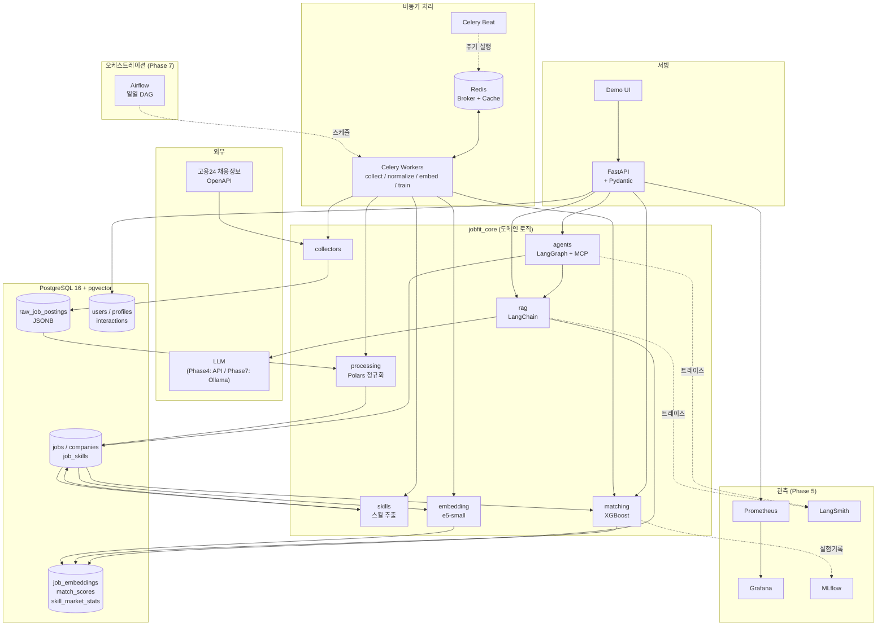
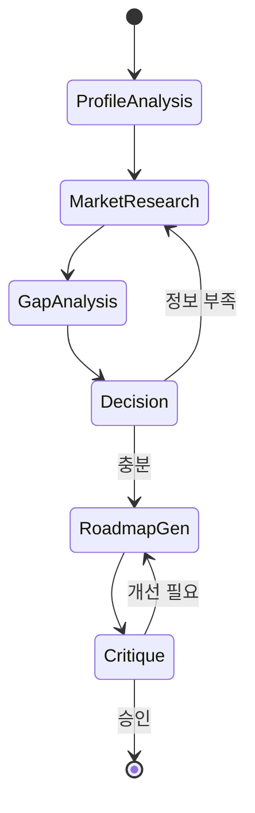

# 02. 시스템 아키텍처

> 이전 ← [01-requirements.md](01-requirements.md) · 다음 → [03-data-model.md](03-data-model.md)

---

## 1. 설계 원칙

1. **레이어드 데이터 파이프라인 (Medallion)** — Raw(원문 불변) → Silver(정규화) → Gold(파생/집계·임베딩).
   하위 레이어가 깨져도 Raw에서 언제든 재생성 가능.
2. **동기 API / 비동기 워커 분리** — 사용자 요청은 FastAPI가 즉시 응답, 무거운 작업(수집·임베딩·모델학습)은 Celery로 위임.
3. **PostgreSQL 단일 진실 저장소** — 관계형 + JSONB + 벡터(pgvector) + 전문검색(tsvector)을 한 DB에서.
   별도 벡터DB를 두지 않아 운영 복잡도를 낮춤 (규모 50만 건까지 충분).
4. **모든 것을 컨테이너로** — 로컬과 Oracle Cloud가 동일한 이미지로 동작.
5. **점진적 고도화** — 규칙 기반 → 통계/ML → 임베딩 → LLM. 각 단계가 이전 단계의 베이스라인을 이긴다는 걸 수치로 증명.

---

## 2. 전체 아키텍처



---

## 3. 컴포넌트 상세

### 3.1 Collector (Phase 1)
- **역할**: 고용24 OpenAPI 호출 → 원문 그대로 저장
- **기술**: `httpx`(async) + `tenacity`(재시도) + Celery
- **설계 포인트**
  - 목록 API로 `source_id` 페이징 수집 → 상세 API로 본문 수집 (2단계)
  - `content_hash = sha256(정규화된 원문)` 으로 변경 감지 → 동일하면 스킵
  - rate limit: 세마포어로 동시성 제한 + 요청 간 최소 간격
  - 실패한 `source_id`는 DLQ 테이블에 적재 후 재시도

### 3.2 Normalizer (Phase 1)
- **역할**: Raw JSONB → `jobs` 정형 테이블
- **기술**: **Polars** (배치 변환, Pandas 대비 수배 빠름) / Pandas는 탐색·시각화용
- **설계 포인트**
  - 순수 함수로 작성: `normalize(raw_df: pl.DataFrame) -> pl.DataFrame` — 테스트 용이
  - 파싱 실패는 예외가 아니라 `null + 사유 컬럼`으로 기록 (파이프라인이 멈추지 않게)
  - Pydantic 모델로 최종 검증 후 UPSERT

### 3.3 Skill Extractor (Phase 1 → 개선 Phase 4)
- **v1 (Phase 1)**: 스킬 사전 + 별칭 + 정규식 매칭
  - `skills` 테이블: `canonical_name`, `aliases[]`, `category`
  - "필수/자격요건" vs "우대사항" 섹션 분리 후 매칭 → `is_required` 판정
  - 오탐 방지: 단어 경계, 한글 조사 처리, 부정 문맥("R&D"의 R ≠ 언어 R)
- **v2 (Phase 4, 선택)**: LLM으로 구조화 추출 후 v1과 비교 평가

### 3.4 Embedder (Phase 3)
- **모델**: `intfloat/multilingual-e5-small` (384차원, CPU로 충분, 한국어 지원)
- **중요**: e5 계열은 접두사 필수 — 문서는 `passage: `, 쿼리는 `query: `
- **청킹**: 공고 본문을 섹션(주요업무/자격요건/우대사항) 단위 + 400토큰 슬라이딩
- **저장**: `job_embeddings(job_id, chunk_idx, chunk_text, embedding vector(384))`
- **인덱스**: HNSW `vector_cosine_ops` (m=16, ef_construction=64)

### 3.5 Matching Engine (Phase 2)
```
Stage 1 (후보 생성, ~1000건)  : 필터(지역/경력/직무) + 벡터 Top-K
Stage 2 (피처 생성)           : 스킬 커버리지, 경력 거리, 급여 갭, 지역 거리, 유사도 ...
Stage 3 (랭킹)                : v1 규칙 가중합 → v2 XGBoost(pairwise rank)
Stage 4 (설명 생성)           : 피처 기여도 → 자연어 근거
```
- MLflow에 파라미터/메트릭/모델 아티팩트 기록, 모델 버전을 `match_scores.model_version`에 저장

### 3.6 RAG (Phase 4)
```
질문 → [쿼리 재작성] → [하이브리드 검색: BM25 + 벡터] → [리랭킹/중복제거]
     → [컨텍스트 조립 + 인용 태깅] → [LLM 생성] → [인용 검증] → 답변
```
- LangChain LCEL 체인, Pydantic으로 출력 구조 강제(`answer`, `citations[]`)
- 평가: RAGAS (faithfulness / answer_relevancy / context_precision / context_recall)
- 골든 데이터셋 50~100쌍을 직접 작성 → 회귀 평가에 사용

### 3.7 Agent (Phase 6)

- LangGraph `StateGraph`, 상태는 Pydantic 모델
- 도구는 **MCP 서버**로 노출: `search_jobs`, `get_skill_stats`, `compute_skill_gap`

---

## 4. 배포 토폴로지

### 개발 (로컬 Windows, x86_64)
```
docker compose up
├─ postgres:16 (pgvector 확장)
├─ redis:7
├─ api        (FastAPI, uvicorn --reload, 볼륨 마운트)
├─ worker     (Celery worker)
├─ beat       (Celery beat)
├─ mlflow     (Phase 2~)
├─ prometheus (Phase 5~)
├─ grafana    (Phase 5~)
└─ airflow    (Phase 7~, 별도 compose 파일)
```

### 운영 (Oracle Cloud Ampere A1, ARM64, Always Free)
```
VM.Standard.A1.Flex  (4 OCPU / 24GB RAM / 200GB)
└─ k3s (단일 노드)
   ├─ Deployment: api (2 replica) + Service + Ingress(Traefik)
   ├─ Deployment: worker (2 replica)
   ├─ Deployment: beat (1)
   ├─ StatefulSet: postgres + PVC
   ├─ Deployment: redis
   ├─ Deployment: ollama (Phase 7, 소형 모델)
   ├─ kube-prometheus-stack (Prometheus + Grafana)
   └─ Secret / ConfigMap
```
- 이미지: GitHub Actions에서 **multi-arch(amd64+arm64)** 빌드 → GHCR 푸시
- 배포: main 머지 시 GHCR 푸시 → 서버에서 `kubectl set image` (또는 워크플로에서 SSH)

---

## 5. 기술 선택 근거 (요약)

| 선택 | 이유 | 대안과 비교 |
|---|---|---|
| PostgreSQL + pgvector | 관계형·JSONB·벡터·전문검색을 한 곳에서. 트랜잭션 보장 | Pinecone/Qdrant: 별도 운영·동기화 비용. 50만 건 미만이면 pgvector로 충분 |
| Polars (배치) + Pandas (탐색) | Polars는 lazy/멀티스레드로 대용량 변환에 유리, Pandas는 생태계·시각화 | 둘 다 씀. 변환은 Polars, 분석/노트북은 Pandas |
| Celery + Redis | 파이썬 표준 비동기 작업 큐, 재시도·스케줄링 내장 | RQ: 단순하지만 기능 부족 / Kafka: 과함 |
| XGBoost | 정형 피처 중심 랭킹에서 딥러닝 대비 적은 데이터로도 강함 | 딥러닝 추천모델: 데이터 부족으로 부적합 |
| e5-small | 384d로 가볍고 CPU 가능, 다국어(한국어) 지원, MTEB 성능 양호 | KoSimCSE: 한국어 특화지만 유지보수·다국어 약함 / e5-large: CPU에 무거움 |
| FastAPI + Pydantic | 타입 기반 검증 + 자동 OpenAPI 문서 + async | Flask: 비동기·검증 수동 / Django: 과함 |
| Airflow | 스케줄링·의존성·백필·재실행 UI가 성숙 | Prefect/Dagster도 좋지만, 시장 수요와 학습가치는 Airflow |
| k3s | ARM64 단일 노드에서 가벼운 완전한 k8s. 쿠버네티스 개념 학습 | Compose만: 배포 학습 부족 / EKS: 비용 |

---

## 6. 횡단 관심사

| 관심사 | 방식 |
|---|---|
| 설정 | `pydantic-settings` + `.env` (12-factor). 코드에 시크릿 금지 |
| 로깅 | `structlog` JSON 로그, `request_id` 미들웨어로 전 구간 전파 |
| 에러 | FastAPI exception handler로 일관된 에러 스키마 `{code, message, request_id}` |
| 마이그레이션 | Alembic. 스키마 변경은 반드시 마이그레이션 파일로 |
| 테스트 | pytest + testcontainers(또는 compose로 띄운 테스트 DB) |
| 시간 | 모든 타임스탬프 UTC 저장, 표시 시점에 KST 변환 |
