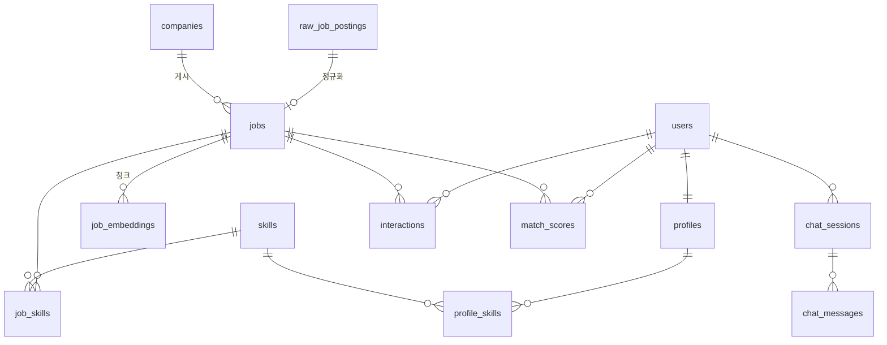

# 03. 데이터 모델

> 이전 ← [02-architecture.md](02-architecture.md) · 다음 → [04-roadmap.md](04-roadmap.md)

---

## 1. ERD

---

## 2. 레이어별 테이블

### Layer 1 — RAW (불변)

**`raw_job_postings`** — 수집 원문. 절대 UPDATE 하지 않고 append-only.
| 컬럼 | 타입 | 설명 |
|---|---|---|
| id | BIGSERIAL PK | |
| source | TEXT NOT NULL | `'work24'` 등 |
| source_id | TEXT NOT NULL | 외부 공고 ID |
| endpoint | TEXT | 어떤 API에서 왔는지 (`list` / `detail`) |
| payload | JSONB NOT NULL | 응답 원문 |
| content_hash | TEXT NOT NULL | sha256(payload 정규화) |
| fetched_at | TIMESTAMPTZ NOT NULL DEFAULT now() | |
| processed_at | TIMESTAMPTZ NULL | 정규화 완료 시각 |

인덱스: `UNIQUE(source, source_id, content_hash)`, `INDEX(processed_at) WHERE processed_at IS NULL`

**`ingestion_runs`** — 수집 실행 이력
| 컬럼 | 타입 | 비고 |
|---|---|---|
| id | BIGSERIAL PK | |
| source | VARCHAR(32) NOT NULL | |
| status | VARCHAR(16) NOT NULL DEFAULT 'running' | `running`/`success`/`failed` |
| started_at | TIMESTAMPTZ NOT NULL DEFAULT now() | |
| finished_at | TIMESTAMPTZ NULL | |
| **api_calls** | INTEGER NOT NULL DEFAULT 0 | **사람인 일 500회 한도 추적** ([ADR-001](decisions/ADR-001-data-source.md)) |
| fetched_count | INTEGER NOT NULL DEFAULT 0 | 가져온 건수 |
| new_count | INTEGER NOT NULL DEFAULT 0 | 실제 신규 적재 건수 |
| error_count | INTEGER NOT NULL DEFAULT 0 | |
| error_detail | JSONB NULL | |

인덱스: `INDEX(source, started_at)`

> 카운터 컬럼은 `default=` (파이썬) 가 아니라 **`server_default=`** 로 선언한다.
> 파이썬 기본값은 ORM을 거칠 때만 채워지므로, psql·Airflow·raw SQL 로 INSERT 하면
> NOT NULL 위반이 난다. **DB가 채우게 해야 어느 경로로 들어와도 안전하다.**

---

### Layer 2 — SILVER (정규화)

**`companies`**
| 컬럼 | 타입 | 설명 |
|---|---|---|
| id | BIGSERIAL PK | |
| name | TEXT NOT NULL | |
| name_normalized | TEXT | 공백/법인격 제거 (매칭용) |
| industry_code | TEXT | 업종 코드 |
| size_category | TEXT | `large` / `mid` / `small` / `startup` / `unknown` |
| created_at | TIMESTAMPTZ | |

인덱스: `UNIQUE(name_normalized)`

**`jobs`** — 핵심 테이블
| 컬럼 | 타입 | 설명 |
|---|---|---|
| id | BIGSERIAL PK | |
| source | TEXT NOT NULL | |
| source_id | TEXT NOT NULL | |
| company_id | BIGINT FK → companies | |
| title | TEXT NOT NULL | 공고 제목 |
| job_category | TEXT | 직무 대분류 (정규화된 코드) |
| description | TEXT | 본문 전체 |
| sections | JSONB | `{main_tasks, requirements, preferred, benefits}` 분리 결과 |
| employment_type | TEXT | `fulltime`/`contract`/`intern`/`parttime` |
| exp_min | SMALLINT | 최소 경력(년), 신입=0 |
| exp_max | SMALLINT | 최대 경력(년), 무관=NULL |
| education | TEXT | `none`/`highschool`/`college`/`bachelor`/`master`/`phd` |
| salary_min | INTEGER | 연봉 하한(원). 미기재 NULL |
| salary_max | INTEGER | 연봉 상한(원) |
| salary_raw | TEXT | 원문 문자열 (디버깅용) |
| region_code | TEXT | 시도/시군구 코드 |
| region_name | TEXT | |
| posted_at | DATE | |
| deadline | DATE | 상시채용 NULL |
| url | TEXT | 원문 링크 |
| status | TEXT | `open`/`closed`/`expired` |
| parse_flags | JSONB | 파싱 실패 사유 기록 |
| content_hash | TEXT | 변경 감지 |
| search_tsv | TSVECTOR | 전문검색용 (GENERATED) |
| created_at, updated_at | TIMESTAMPTZ | |

인덱스:
- `UNIQUE(source, source_id)`
- `INDEX(status, deadline)` — 유효 공고 필터
- `INDEX(region_code, job_category)`
- `INDEX(exp_min, exp_max)`
- `GIN(search_tsv)` — 키워드 검색
- `GIN(sections jsonb_path_ops)`

**`skills`** — 스킬 사전 (수작업 + 확장)
| 컬럼 | 타입 | 설명 |
|---|---|---|
| id | SERIAL PK | |
| canonical_name | TEXT UNIQUE NOT NULL | `PostgreSQL` |
| aliases | TEXT[] | `{postgres, psql, 포스트그레스}` |
| category | TEXT | `language`/`framework`/`database`/`cloud`/`tool`/`soft`/`domain` |
| match_patterns | TEXT[] | 정규식(선택) |
| is_active | BOOLEAN DEFAULT true | |

인덱스: `GIN(aliases)`

**`job_skills`**
| 컬럼 | 타입 | 설명 |
|---|---|---|
| job_id | BIGINT FK | |
| skill_id | INT FK | |
| is_required | BOOLEAN | 필수(true) / 우대(false) |
| occurrences | SMALLINT | 등장 횟수 |
| confidence | REAL | 0~1 |
| extracted_by | TEXT | `dict_v1` / `llm_v1` |
| PK | (job_id, skill_id) | |

---

### Layer 3 — GOLD (파생)

**`job_embeddings`**
| 컬럼 | 타입 | 설명 |
|---|---|---|
| id | BIGSERIAL PK | |
| job_id | BIGINT FK ON DELETE CASCADE | |
| chunk_idx | SMALLINT | |
| chunk_type | TEXT | `title`/`tasks`/`requirements`/`full` |
| chunk_text | TEXT | |
| embedding | VECTOR(384) | L2 정규화된 e5-small 출력 |
| model_name | TEXT | `intfloat/multilingual-e5-small` |
| created_at | TIMESTAMPTZ | |

인덱스: `UNIQUE(job_id, chunk_idx)`, `HNSW (embedding vector_cosine_ops) WITH (m=16, ef_construction=64)`

**`skill_market_stats`** — 스킬 수요 집계 (일배치)
| 컬럼 | 타입 |
|---|---|
| snapshot_date DATE, job_category TEXT, skill_id INT, job_count INT, required_count INT, avg_salary_min INT, rank_in_category SMALLINT |

PK: `(snapshot_date, job_category, skill_id)`

**`match_scores`** — 계산된 적합도 (캐시)
| 컬럼 | 타입 | 설명 |
|---|---|---|
| user_id, job_id | FK | |
| score | REAL | 0~100 |
| features | JSONB | 피처 값 (설명 생성용) |
| model_version | TEXT | `rule_v1` / `xgb_20260920_a1b2` |
| computed_at | TIMESTAMPTZ | |
| PK | (user_id, job_id, model_version) | |

---

### Layer 4 — 사용자/애플리케이션

**`users`**: id, email(UNIQUE), password_hash, is_active, created_at
**`profiles`**: id, user_id(UNIQUE FK), years_experience REAL, education, desired_titles TEXT[], desired_regions TEXT[], desired_salary_min INT, summary TEXT, resume_text TEXT, updated_at
**`profile_skills`**: profile_id, skill_id, level SMALLINT(1~5), years REAL, PK(profile_id, skill_id)
**`interactions`**: id, user_id, job_id, event_type(`view`/`save`/`apply`/`dismiss`/`click`), dwell_ms INT, created_at — **ML 학습 라벨의 원천**
**`chat_sessions`**: id UUID, user_id, title, created_at
**`chat_messages`**: id, session_id, role(`user`/`assistant`/`system`), content, citations JSONB, latency_ms, token_usage JSONB, trace_id, created_at

---

## 3. 적합도 피처 정의 (Phase 2에서 사용)

| 피처 | 계산 | 직관 |
|---|---|---|
| `skill_required_coverage` | 보유∩필수 / 필수 | 필수 요건 충족률 (가장 중요) |
| `skill_preferred_coverage` | 보유∩우대 / 우대 | 우대 요건 충족률 |
| `skill_weighted_score` | Σ(보유스킬 level × 요구가중치) / Σ요구가중치 | 숙련도 반영 |
| `missing_required_count` | 필수 중 미보유 개수 | 탈락 요인 |
| `exp_gap` | `profile.years - job.exp_min` | 음수면 부족 |
| `exp_fit` | 구간 내 1.0, 벗어나면 거리 기반 감쇠 | 경력 적합도 |
| `education_fit` | 학력 요구 충족 0/1 | |
| `region_match` | 희망 지역 포함 0/1 | |
| `salary_gap_ratio` | `(job.salary_min - desired_salary_min)/desired` | 기대 대비 |
| `semantic_similarity` | 프로필 임베딩 · 공고 임베딩 (코사인) | 텍스트 의미 유사도 |
| `title_similarity` | 희망 직무명 vs 공고 제목 유사도 | |
| `job_popularity` | 해당 공고 조회/저장 수 (log) | 인기 보정 |
| `days_until_deadline` | 마감 임박도 | |

라벨 정의 (Phase 2):
- `apply` = 3, `save` = 2, `view(dwell>10s)` = 1, `dismiss` = 0
- 콜드 스타트 구간에는 **규칙 기반 pseudo-label** + 수동 라벨 200쌍으로 시작

---

## 4. 마이그레이션 순서 (Alembic)

| 리비전 | 내용 | Phase | 상태 |
|---|---|---|---|
| 0001 | extension `vector`, `pg_trgm` | 0 | ✅ 적용 |
| 0002 | `raw_job_postings`, `ingestion_runs` | 1 | ✅ 적용 |
| 0003 | `companies`, `jobs` (+인덱스, tsvector) | 1 | ✅ 적용 |
| 0004 | `skills`, `job_skills` | 1 | ✅ 적용 |
| 0005 | `users`, `profiles`, `profile_skills`, `interactions` | 2 | ⬜ |
| 0006 | `match_scores`, `skill_market_stats` | 2 | ⬜ |
| 0007 | `job_embeddings` + HNSW 인덱스 | 3 | ⬜ |
| 0008 | `chat_sessions`, `chat_messages` | 4 | ⬜ |
| 0009 | `agent_runs` (LangGraph 상태 저장) | 6 | ⬜ |

> 확장(extension) 설치를 0001로 분리했기 때문에 설계 당시 번호에서 하나씩 밀렸다.
> 마이그레이션은 **이미 적용된 리비전을 재번호하지 않는다** — 문서를 실제에 맞춘다.
